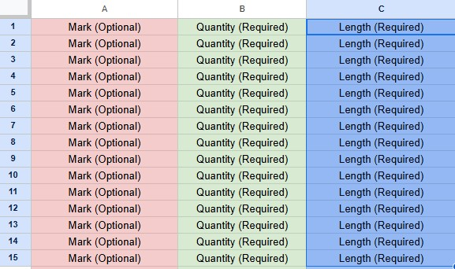

# Waste-Cutting Optimizer
This Python module provides a class for optimizing stock cutting operations, minimizing waste in multi-cut scenarios. It is designed to work with a list of marked pieces, considering cutting losses (blade width), joint limits, and minimum useful lengths.

## Features
Accepts marked pieces with labels

Supports optional exclusion of piece to be jointed

Limits the number of joints per stock bar

Calculates total waste and stock usage

Generates a detailed cut list in PDF format

## Requirements
Python 3.8+

pandas

reportlab

# You can install required dependencies with:
```python
pip install -r requirements.txt
```

# How to Use
```python
import waste_cutting_optimizer as opt
```

# Parameters
longer_than = 4500          # Minimum jointable piece in stock length
stock_length = 12000        # Total available stock length
blade_width = 2             # Blade thickness to account for waste
```

# List of marked pieces (length, quantity, label)
```python
marked_pieces = [
    (8535, 9, 'P10'),
    (7807, 6, 'P14'),
    (1200, 5, 'P15'),
    (948, 5, 'P18'),
    (7807, 2, 'P19'),
    (1207, 1, 'P20'),
]

excluded_pieces = 0  # Optional: number of shortest pieces to exclude
```

# Create optimizer instance
```python
cuts = opt.WasteCuttingStockOptimizer(stock_length, blade_width, max_joints=3)
```

# Optimize and retrieve patterns
```python
patterns, remaining = cuts.optimize_with_waste(marked_pieces, longer_than)
```

# Output
```python
cuts.print_solution(patterns, remaining)
cuts.print_summary(patterns, remaining)
cuts.generate_pdf("mia_distinta.pdf")
```


Output
Printed output includes the optimized cutting patterns and summary

PDF file (mia_distinta.pdf) contains a ready-to-print cut list

##Folder Structure
```
CuttingStockOptimizer/
│
├── cutting_stock_optimizer/           # Your main Python module
├── tests/                             # Unit tests (optional but recommended)
├── examples/                          # Example PDF, Excel and image files
├── requirements.txt                   # Python dependencies
├── .gitignore                         # Files to exclude from Git tracking
└── README.md                          # This file
```

## 📥 Excel Input Example
You can also provide the input data via an Excel file. The file should consist of either 2 columns (Quantity, Length) or 3 columns (Mark, Quantity, Length).
📸 See the structure in the image below




License
MIT License — feel free to use, modify, and share with attribution.

## Contributions
Pull requests are welcome! If you find issues or have suggestions, please open an issue in the repository.

## Author
Federico Sidraschi https://www.linkedin.com/in/federico-sidraschi-059a961b9/
